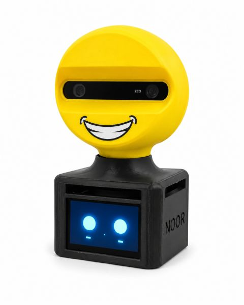

# Noor - AI-Powered Arabic Language Tutor for Autistic Children

Noor is an AI-powered interactive Arabic language tutor designed to support language practice and social engagement for children with Autism Spectrum Disorder (ASD) in Arabic-speaking communities.

> Note: the uploaded presentation is a short graduation-defense overview. It explains only part of the project. This README gives a more complete technical summary based on the full project documentation, including the problem, architecture, hardware, software modules, interaction flow, testing approach, limitations, and future work.

## Prototype



## Project Motivation

Many assistive and educational tools for autistic children are either screen-only applications, expensive therapy robots, or systems designed mainly for Western contexts. These solutions often do not support Arabic dialects naturally and may not match the communication style children use at home.

Noor was designed to address this gap by combining Arabic-aware AI, physical interaction, visual perception, an animated face, and child-friendly responses in one affordable embedded prototype.

## Problem Statement

Autistic children in Arabic-speaking countries face limited access to language-learning tools that are:

- Affordable
- Interactive
- Arabic-friendly
- Culturally relevant
- Capable of voice interaction
- More engaging than screen-only apps
- Able to provide simple, predictable, child-centered communication

Noor focuses on creating a low-cost AI-powered Arabic tutor that combines speech, vision, emotion awareness, and physical engagement.

## Project Aim

The aim of Noor is to design and implement an AI-powered interactive Arabic tutor that supports language practice and social engagement for children with Autism Spectrum Disorder.

## Main Objectives

- Build a physical interactive prototype using embedded hardware
- Capture Arabic speech using a microphone array
- Detect voice activity and support smart interruption
- Convert Arabic speech to text using speech-to-text AI
- Generate simple and safe Arabic responses using an LLM
- Convert generated responses to natural Arabic speech
- Track the child using camera-based visual perception
- Use face and sound direction to orient the robot toward the child
- Display an animated face with idle, listening, and speaking states
- Use servo motors for smooth child-friendly physical motion
- Support emotion-aware and adaptive interaction

## Target Users

- Children aged 3 to 10 with ASD
- Parents supervising interaction at home
- Therapists and teachers using the prototype as a supportive educational tool

Noor is an educational graduation-project prototype. It is not a diagnostic tool, medical device, or replacement for therapists.

## System Overview

Noor is a multi-modal AI companion. It interacts with the child through:

- Arabic speech input
- Arabic speech output
- Animated facial expressions
- Camera-based visual perception
- Physical head/camera movement
- Emotion-aware response behavior

## Hybrid Edge-Cloud Architecture

Noor follows a hybrid edge-cloud architecture.

### Edge Side - Local Processing

The local side handles real-time interaction tasks:

- Audio capture
- Voice activity detection
- Face tracking
- Emotion recognition
- Servo-angle calculation
- Animated face display
- Arduino servo control
- System coordination

### Cloud Side - AI Services

The cloud side handles computationally heavy language tasks:

- Arabic speech-to-text
- Language reasoning
- Arabic text-to-speech

This split allows the system to stay responsive while still using strong AI services for Arabic language interaction.

## Interaction Flow

```text
Child speaks or appears in front of Noor
                |
                v
        Camera + Microphone
                |
                v
       Local Jetson Processing
   VAD + Tracking + Coordination
                |
                v
          Cloud AI Pipeline
 Arabic STT -> LLM Reasoning -> Arabic TTS
                |
                v
       Coordinated Robot Response
                |
      +---------+----------+
      |         |          |
   Speaker   Display   Servo Motion
```

## Hardware Components

| Component | Role |
|---|---|
| NVIDIA Jetson | Main embedded processor running Python modules, OpenCV, API communication, and coordination |
| ZED 2 Camera | Face tracking, child localization, and visual perception |
| ReSpeaker USB Mic Array V3.1 | Speech capture and sound-direction support |
| Arduino Uno | PWM servo control and hardware movement interface |
| Servo Motors | Pan/tilt movement for orienting Noor toward the child |
| Display Screen | Shows Noor's animated face states |
| Speaker | Plays generated Arabic voice output |
| LM2596 Buck Converters | Regulate voltage for safe power distribution |
| External Power Supply | Powers the processing unit, servos, and peripherals |

## Software Components

| Module | Function |
|---|---|
| Listener Module | Captures microphone input and applies voice activity detection |
| Transcription Module | Sends Arabic audio to Groq Whisper and receives text |
| Brain Module | Sends context to Gemini and generates child-appropriate Arabic responses |
| Speaker Module | Sends generated text to ElevenLabs and plays Arabic audio |
| Vision Module | Processes camera frames for face tracking and emotion recognition |
| Motion Module | Sends servo-angle commands to Arduino |
| Face UI Module | Displays Noor's animated idle, listening, and speaking states |

## AI Pipeline

Noor uses a three-stage AI pipeline:

1. **Speech-to-Text** - Arabic speech is transcribed using Groq Whisper.
2. **Language Reasoning** - Gemini generates short, simple, safe, child-appropriate Arabic responses.
3. **Text-to-Speech** - ElevenLabs converts the response into natural Arabic speech.

## Computer Vision and Emotion Awareness

The vision module uses camera frames to:

- Detect the child's face
- Track face position
- Estimate whether the child is centered in the frame
- Support physical orientation through servo movement
- Provide a basis for emotion-aware interaction

Emotion recognition can help the system adapt its behavior using actions such as encouragement, empathy, stories, riddles, or simple jokes.

## Servo Motion System

The motion system gives Noor a more natural physical presence.

- The Jetson calculates the required movement from face or sound-direction data.
- The target angle is sent to Arduino through serial communication.
- Arduino generates PWM signals to control the servo motors.
- Motion is kept smooth and limited to safe angles for child-friendly interaction.

## Smart Interruption

During speech playback, Noor continues monitoring the microphone. If the child starts speaking while Noor is talking, the system can stop playback and return to listening mode.

This makes the interaction feel more natural and prevents the robot from speaking over the child.

## Animated Face Interface

The display provides visual feedback using clear face states:

- Idle
- Listening
- Speaking

The animated face helps make the system friendlier and easier for children to understand.

## Implementation Direction

The final implementation direction is Python-based with direct API integration.

An n8n workflow idea was considered early for visual prototyping, but the final design uses Python because real-time interaction needs better control over:

- Multi-threading
- Audio streaming
- Smart interruption
- Camera processing
- API timing
- Servo synchronization
- Hardware communication

## Testing Approach

The project testing approach includes module-level and integration-level testing.

| Test Area | Expected Result |
|---|---|
| Audio Capture | Speech is detected and background noise is ignored |
| STT API | Spoken Arabic is converted into readable text |
| LLM Response | Responses are short, simple, and child-appropriate |
| TTS API | Clear Arabic audio is generated and played |
| Face Tracking | Face position is detected and tracking error is calculated |
| Servo Synchronization | Servo motors move smoothly to commanded angles |
| Smart Interruption | Playback stops when the child starts speaking |
| Full Integration | Noor responds with voice, face display, and physical motion |

## Current Limitations

- Cloud APIs require stable internet connectivity.
- Arabic speech recognition quality depends on pronunciation, dialect, and audio clarity.
- Emotion recognition can be affected by lighting, camera angle, and occlusion.
- The prototype is not a clinical therapy tool.
- More supervised testing with specialists and children is required.

## Results

The project defines and demonstrates a clear framework for building an affordable Arabic assistive AI tutor. The final system design integrates:

- Hybrid edge-cloud architecture
- Arabic AI voice pipeline
- Computer vision pipeline
- Emotion-aware interaction concept
- Arduino-based servo movement
- Animated face feedback
- Child-friendly multi-modal interaction

## Future Work

- Expand Arabic dialect support
- Conduct supervised pilot studies with therapists and children
- Improve privacy using partial offline STT/TTS options
- Design a cleaner enclosure and custom PCB
- Add a parent or therapist dashboard
- Improve emotion recognition under different lighting conditions
- Enhance adaptive learning and personalization

## Project Presentation

The repository includes a short graduation defense presentation:

[Noor Project Presentation](Noor_Project_Presentation.pdf)

The presentation provides a concise overview of the problem, motivation, objectives, high-level system concept, and hybrid architecture.

## Repository Files

- `Noor_Project_Presentation.pdf` - short graduation defense presentation
- `noor-prototype.jpg` - Noor prototype image
- `README.md` - detailed project documentation summary

## Source Code

The source code is intentionally not included in this public repository.

This repository documents the concept, architecture, implementation approach, hardware/software design, and project results without publishing the private source code.

## Technologies

- Python
- Arduino C/C++
- NVIDIA Jetson
- OpenCV
- WebRTC VAD
- PyTorch / ONNX Runtime
- Groq Whisper
- Gemini API
- ElevenLabs API
- Serial Communication
- Computer Vision
- Speech Processing
- Embedded Systems
- Edge-Cloud Integration
- Human-Robot Interaction

## Author

**Mohammad Ahmad Elayyan**

- Email: [mohamadelayyan84@gmail.com](mailto:mohamadelayyan84@gmail.com)
- LinkedIn: https://www.linkedin.com/in/mohammadelayyan1
- GitHub: [MohammadElayyan117](https://github.com/MohammadElayyan117)
